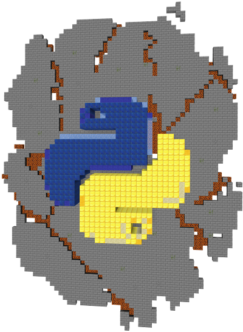

# Warsztaty Programowania

To repozytorium zawiera zadania do warsztatów z programowania w Pythonie 

[facebook](https://www.facebook.com/Warsztaty-Programowania-Trzebinia-635087866893182)

## Części
- [1 - Podstawy](1.md)
- [2 - Listy](2.md)
- [3 - Gry w terminalu](3.md) ewentulnie [wersja bardziej spolszczona](3pl.md)
- [4 - Komunikacja sieciowa](4.md)
- [5 - Wizualizacja danych](5.md)

[Kod do gry Ogar.io](ogar_io)  
[Prezentacja - Security](https://docs.google.com/presentation/d/1DB7DttPP8xkBTjrf9BrwUlI9456mzspRYfrJeHERpgE/edit?usp=sharing) Dominik Czanota

Prezentacje: 
- [1. Podstawy podstaw](https://docs.google.com/presentation/d/17l3NKQCqEwofyKpeuP51exhxsSwYy1Y2pgfbtFV5EHc/edit?usp=sharing)
- [2](https://docs.google.com/presentation/d/1aIOXV5VxCjz2XJKGtEi4qgPG7rqQT3iLlgM9aGVppAE/edit?usp=sharing)
- [3](https://docs.google.com/presentation/d/1toEqvJ9Szw4NUdvIGaLClMUlZWyIbWyyOWzWsjkuXek/edit?usp=sharing)

## Wykorzystane materiały
 [raspberryjammod](https://github.com/arpruss/raspberryjammod) - mod do Minecraft 
 pozwalający na komunikację za pomocą biblioteki [mcpi](https://github.com/martinohanlon/mcpi) (biblioteki do Pythona). 
 Wymaga minecrafta 1.12.2 i zainstalowania [Minecraft Forge](http://files.minecraftforge.net/) 
 Bezpośredni link do [konkretnej wersji](https://files.minecraftforge.net/maven/net/minecraftforge/forge/1.12.2-14.23.5.2796/forge-1.12.2-14.23.5.2796-installer.jar)
