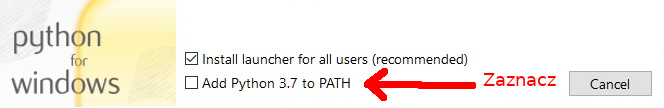
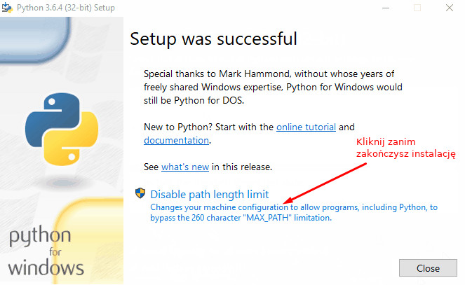

## Instalacja Pythona

1. Pobierz [Pythona 3.7.2 x64](https://www.python.org/ftp/python/3.7.2/python-3.7.2-amd64.exe) (wersja nie ma większego znaczenia, ważnę żeby był 3 a nie 2)
1. 
1. 
1. Pobierz [Pycharma](https://www.jetbrains.com/pycharm/download/#section=windows) wybierz darmową wersję Community
1. Zainstaluj, nie trzeba robić nic specjalnego
1. Uruchom i stwórz nowy projekt