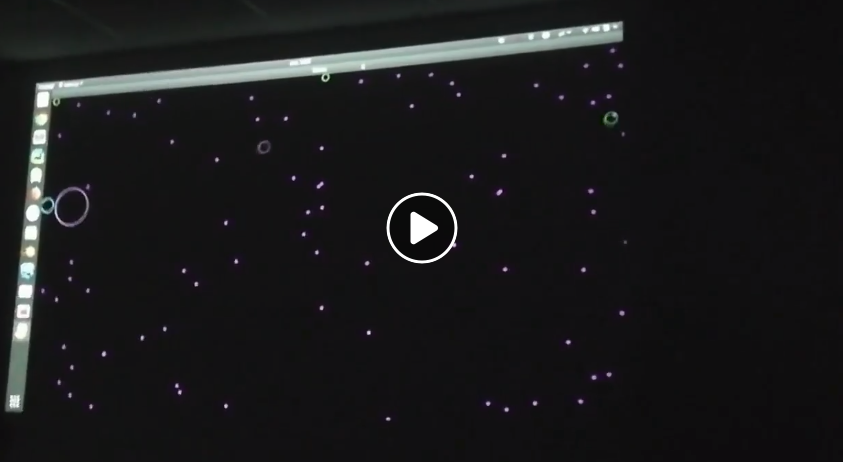

# Ogar.io
Gra w stylu [agar.io](https://agar.io/) napisana w Pythonie. Na zajęciach pisaliśmy klienta do niej i 
omawialiśmy działanie serwera.

## Instalacja

`pip install -r requirements.txt`

## Uruchamianie

`python main.py` - serwer  
`python client.py` - klient  

## Szczegóły techniczne
Część serwerowa: `main.py` uruchamia samą gre napisaną w [Pygame](https://www.pygame.org/news) 
oraz prosty serwer napisany we [Flask](http://flask.pocoo.org/). 
Działają jako dwa oddzielne procesy i komunikują się używając `multiprocessing.Queue`. 
Serwer wystawia API `/down`, `/up`, `/left`, `/right`. 
Gracz jest identyfikowany za pomocą cookie z identyfikatorem. 
Każde zapytanie dodaje do kolejki komendę ruchu dla tego użytkownika, 
a [pętla gry](game.py#L58) konsumuje zadania z kolejki i rusza graczem / dodaje nowego.

Część klienta: Wykorzystując Pygame reaguje na naciśnięcia klawiszy, i wysyła zapytania do serwera. 
Ważne jest żeby używać tutaj `requests.Session` aby przechowywać cookie między zapytaniami.
